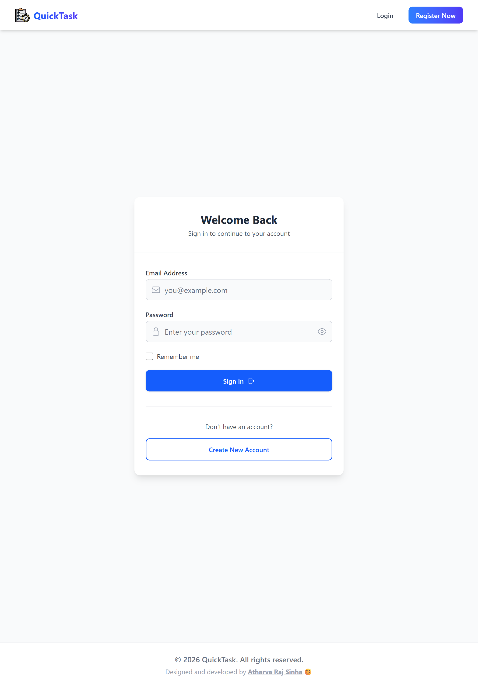
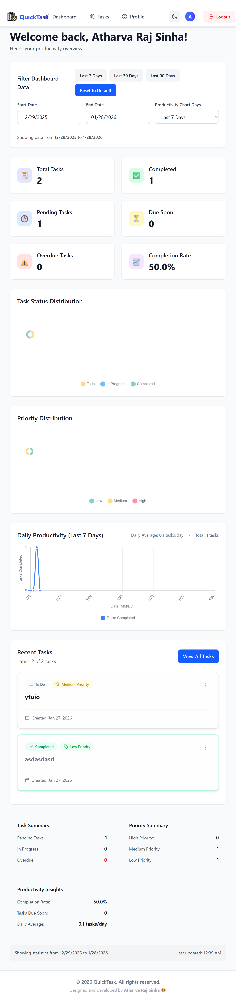

# QuickTask

A full‑stack task management application with productivity analytics, built using the MERN stack and a separate Python analytics microservice.

---

## Project Overview

QuickTask allows users to:

* Register and authenticate securely
* Create, update, delete, and manage tasks
* Filter, search, and sort tasks
* View a dashboard with task analytics
* Toggle dark/light mode
* Export tasks as CSV
* Analyze productivity using a Python microservice

**Live Demo:** [https://quicktask-todo.vercel.app](https://quicktask-todo.vercel.app)

---

## Technology Stack Used

### Frontend

* React.js
* Axios
* Chart libraries (for analytics)
* Tailwind CSS

### Backend

* Node.js
* Express.js
* MongoDB
* JWT Authentication

### Python Microservice

* Python 3.10.0
* Django
* REST APIs

---

## Prerequisites

Make sure the following are installed:

* Node.js >= 18.x
* npm >= 9.x
* Python 3.10.0
* pip
* MongoDB (local or Atlas)
* Git

---

## Repository Structure

```
QuickTask/
│
├── frontend/            # React application
├── backend/             # Node + Express API
├── python_microservice/ # Django analytics service
└── README.md
```

---

## Step‑by‑Step Installation & Setup

### 1. Clone the Repository

```bash
git clone https://github.com/atharvarajsinha/QuickTask.git
cd QuickTask
```

---

### 2. Backend Setup (Node + Express)

```bash
cd backend
npm install
```

Create `.env` file using the example below.

```bash
npm run dev
```

Backend runs on: `http://localhost:5000`

---

### 3. Frontend Setup (React)

```bash
cd frontend
npm install
npm run dev
```

Frontend runs on: `http://localhost:5173`

---

### 4. Python Microservice Setup (Django)

```bash
cd python_microservice
python -m venv venv
source venv/bin/activate   # Windows: venv\Scripts\activate
pip install -r requirements.txt
python manage.py migrate
python manage.py runserver
```

Python service runs on: `http://127.0.0.1:8000`

---

## Environment Variables

### Backend (`backend/.env.example`)

```
PORT=5000
MONGO_URI=your_mongodb_connection_string
JWT_SECRET=your_jwt_secret
```

### Frontend (`frontend/.env.example`)

```
VITE_NODE_API_URL=node_server_url
VITE_ANALYTICS_API_URL=python_service_url
```

### Python Microservice (`python_microservice/.env.example`)

```
DEBUG=True
SECRET_KEY=your_django_secret_key
MONGO_URI=your_mongodb_connection_string
JWT_SECRET=your_jwt_secret
ALLOWED_HOSTS=localhost,127.0.0.1
```

---

## How to Run Each Service

| Service        | Command                      | Port |
| -------------- | ---------------------------- | ---- |
| Backend        | `npm run dev`                | 5000 |
| Frontend       | `npm run dev`                | 5173 |
| Python Service | `python manage.py runserver` | 8000 |

---

## API Endpoint Documentation

### Authentication

* `POST /auth/register` - User Registration
* `POST /auth/login` - User Login

### User

* `GET /user/profile` – Fetch user details
* `PUT /user/profile` – Update profile
* `POST /user/change-password` - Change Password
* `DELETE /user/delete-account` - Delete Account
* `PATCH /user/toggle-mode` – Dark/Light mode

### Task

* `GET /tasks/` – Fetch all Tasks (with query params) []
* `POST /tasks/` – Create new Task
* `GET /tasks/:id/` – Get particular Task
* `PUT /tasks/:id/update` - Update Task
* `DELETE /tasks/:id/delete` - Delete Task
* `PATCH /tasks/:id/status` - Update Task Status
* `GET /tasks/export/csv` - Export Tasks to CSV

### Category

* `GET /category/` – Fetch all Category
* `POST /category/` – Create new Category
* `GET /category/:id/` – Get particular Category
* `PUT /category/:id/update` - Update Category
* `DELETE /category/:id/delete` - Delete Category

Query Parameters Supported:
* status
* priority
* search
* sortBy
* order

### Python Microservice

* `GET /analytics/stats/` - Shows user tasks stats endpoints
* `GET /analytics/productivity/` - Shows user productivity endpoint
* `GET /analytics/public-stats/` - Homepage API endpoint

---

## Screenshots of the Application







---

## Deployed Version

Frontend: [https://quicktask-todo.vercel.app](https://quicktask-todo.vercel.app)

---

**Author:** Atharva Raj Sinha
